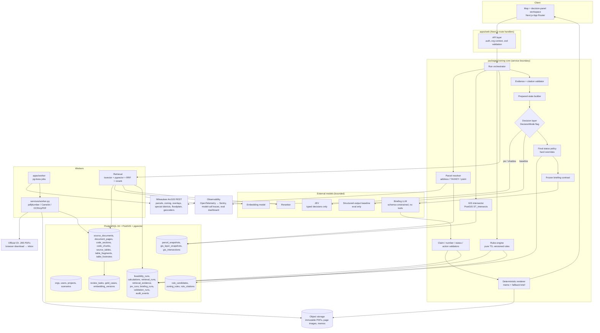

# 02 — System architecture

**Status:** planning draft, 2026-09-21.
**Reads with:** `01_product_scope.md` (what), `03_data_model.md` (tables), `04_zoning_rag_design.md` (evidence layer), `05_decisioning_design.md` (decision layer), `06_delivery_plan.md` (when).

## 1. Shape of the system

A **modular monolith**: one TypeScript codebase deployed as a web app plus a worker, with a small Python service for PDF work, all sharing one PostgreSQL database. Modules are separated by package boundaries and a service interface, not by network calls. Microservices are not justified: pilot volume is tens of screens per day, and the safety properties depend on one transaction pinning one run to exact source versions, which is easiest in one database.

The user-facing surface is a **map + decision-panel workspace**, not a chat. The workspace shows: parcel and layers on the map, site facts, scenario form, findings with proposed vs allowed, coverage panel, citations, next actions, and the memo. A narrative box may prefill the scenario form later, but the form is the input of record.

```
apps/web                 Next.js 15 (App Router), TypeScript, MapLibre GL, shadcn/ui
packages/zoning-core     service layer: parcel resolution, GIS intersection, run orchestration, policy, validators, briefing client, JEV client
packages/rules-engine    pure functions, zero I/O, zero deps beyond zod
packages/db              Drizzle schema + SQL migrations, RLS policies, typed queries
packages/contracts       zod schemas + JSON schemas shared by web, worker, and Python (exported to JSON Schema files)
apps/worker              Node worker on pg-boss: GIS refresh, retrieval, JEV, briefing, eval, source-diff
services/worker-py       FastAPI: PDF parse, tables, OCR fallback, embeddings; writes only to object storage + its own tables via the API
infra/                   docker-compose (local), Dockerfiles, GitHub Actions
docs/                    planning, decisions, learning log
data/                    Tarik's local official source copies (input to ingestion; hashed into object storage on first ingest)
```

Rule: `apps/web` never talks to a model provider or ArcGIS directly. It calls `packages/zoning-core`, which owns every external call and writes every audit row. That boundary is what keeps the safety chain testable without a browser.

## 2. Architecture diagram



## 3. Data-flow boundaries between the four "thinking" parts

| From → To | What crosses | What may never cross |
|---|---|---|
| RAG → Rules engine | Nothing at run time. Rules come from `zoning_rules` (approved rows) whose `rule_citations` point at chunks. RAG produced the *candidates* a reviewer approved, offline. | Raw chunk text, unreviewed candidates |
| RAG → JEV state builder | Booleans and counts: `active_code_version`, `citation_validator_passed`, `required_context_missing[]`, `conflicting_sources`, citation counts per finding | Any ordinance text, chunk ids, URLs |
| RAG → Briefing LLM | ≤ 12 verbatim excerpts with `source_id`, section, page, status — chosen by the evidence-bundle step and filtered to what the locked findings and triggers cite | The ability to query; anything not in the bundle |
| Rules engine → JEV | Findings summarized as category/status/criticality/confidence/citation_count/reason | Calculations, numbers, rule params |
| Rules engine → Briefing LLM | Findings with proposed/allowed strings and `calculation_id` (numbers already formatted by code) | Freedom to recompute |
| JEV → Policy | `JevDecision` (choices, probabilities, confidence) | The status itself; JEV cannot write `final_status` |
| Policy → Briefing LLM | Locked `final_decision`, `allowed_next_actions`, `policy_reasons` | Anything mutable |
| Briefing LLM → UI | JSON that passed every validator, or nothing (fallback brief renders) | Raw model text |

Two invariants enforced in code and tests: (1) no function in `packages/rules-engine` imports anything that does I/O; (2) `feasibility_runs.locked_at` must be non-null before `briefing_runs` can reference the run (DB check via trigger).

## 4. Runtime sequence for one screen

1. User picks a parcel (address → City geocoder → TAXKEY; or TAXKEY; or map click → point query on parcel layer). Stacked-condo hits return >1 TAXKEY → user chooses.
2. Parcel resolver fetches the feature with `outSR=4326`, stores a `parcel_snapshots` row (geometry, attributes, `GIS_DATETIME`, retrieved_at, content hash). Reuses an existing snapshot if hash unchanged and age < 30 days.
3. GIS intersector runs `ST_Intersects` between the parcel geometry and the latest `gis_layer_snapshots` for the selected layers (zoning 11, DPD 1, GPD 2, overlays 4–10, special districts 6/8/17/18/23, floodplain 1–2). Writes `gis_intersections` (layer, feature attrs, overlap area, overlap ratio). Two zoning polygons with overlap ratio > 2% each → `gis_ambiguity`.
4. User saves a scenario (structured fields). Run orchestrator copies inputs into `feasibility_runs.scenario_inputs`.
5. Rules engine evaluates approved rules for the district(s) → findings + calculations.
6. Retrieval builds the evidence bundle for in-scope categories and detected overlays (M4+; before that, citations come straight from `rule_citations`).
7. Evidence validator sets evidence flags; prepared state is built and hashed.
8. Decision layer runs per `DecisionMode`; JEV/baseline logged.
9. Policy locks status, route, reasons, allowed actions.
10. Briefing contract → LLM → validators → render (or fallback). Memo saved to object storage; UI shows workspace.

Steps 1–3 and 5–9 are synchronous (target < 3 s excluding cold GIS fetch). Step 10 runs as a job and streams in; the decision panel never waits on the LLM.

## 5. Component responsibilities

| Component | Owns | Does not own |
|---|---|---|
| Next.js app | Auth session, org context, forms, map, panels, memo viewer, reviewer queue UI | Business rules, model calls |
| API layer (route handlers) | Input validation (zod), RLS context (`SET LOCAL app.org_id`), calling core services, returning envelopes `{ ok, data, error, meta }` | Direct DB writes outside core |
| zoning-core | Parcel resolution, GIS, run orchestration, policy, contracts, validators, JEV/LLM clients, audit events | UI, PDF parsing |
| rules-engine | `evaluate()` and rule kinds | Loading rules, dates, anything with side effects |
| PostgreSQL | System of record, RLS, spatial ops, lexical + vector indexes, queue tables | Blobs |
| Object storage | Original PDFs, page images, rendered memos, upload inbox; immutable object keys with hash in the key | Metadata |
| worker (Node) | Scheduled GIS layer snapshots, legistar watch, retrieval, JEV, briefing, evaluation, source diff | Parsing PDFs |
| worker-py | pdfplumber text + boxes, Docling structure (evaluated in M2), Camelot tables, table-family reconstruction, OCRmyPDF fallback, pypdfium2 page images, embeddings batch | Deciding what becomes active |
| Retrieval | Query planning, hybrid search, expansion, rerank, bundle | Pass/fail |
| JEV client | Building questions, calling, retry/backoff, schema-validating, logging | Status |
| Briefing client | Contract build, schema-constrained call, logging | Rendering unvalidated text |
| Validators | Five families (schema, citation, numeric, status, action) implemented as the eleven checks in `05` §7, plus banned phrases | Fixing text (they reject, never rewrite) |
| Observability | Traces per run with spans per step, model-call table, error tracking, eval dashboard | — |

## 6. Verified external sources (2026-09-21)

Legend: **V** = fetched live this session (`?f=pjson` or page) · **L** = verified from Tarik's local copies in `data/` · **U** = not verified (blocked or not found). Full details in `00_source_verification.md` and `04_zoning_rag_design.md` §2.

| Source | URL | Status | Fields / notes | Update behavior | Failure mode |
|---|---|---|---|---|---|
| ArcGIS REST root | `https://milwaukeemaps.milwaukee.gov/arcgis/rest/services` | V | ArcGIS 10.91; folders `property`, `planning`, `Locator`, `LocatorV11`, … | Unknown cadence; no SLA | Discovery only; known endpoints keep working |
| Parcels (MPROP_full) | `…/property/parcels_mprop/MapServer/2` | V | Polygon, WKID 32054, reprojects with `outSR=4326`; 121 fields incl. `TAXKEY, ZONING, LOT_AREA, CORNER_LOT, NR_UNITS, NR_STORIES, BLDG_AREA, HIST_CODE, GIS_DATETIME`; description states condos are stacked, one polygon per TAXKEY | Per-feature `GIS_DATETIME`; open-data MPROP is refreshed daily | Down → serve last snapshot flagged stale; field rename → contract test fails in CI |
| Address points | `…/property/parcels_mprop/MapServer/22` | V | Point | as above | as above |
| Zoning base | `…/planning/zoning/MapServer/11` (and `/12` with downtown subdistricts) | V | Fields `Zoning, ZoningCFN, ZoningCategory, ZoningType`; `Zoning` is the district code | No `lastEditDate` exposed; detect by snapshot hash | Sliver overlaps → `gis_ambiguity` |
| Planned developments | `…/planning/zoning/MapServer/1` (DPD), `/2` (GPD) | V | `DPD_NAME/GPD_NAME, CFN, CFN_LINK, CC_ACTION_TYPE`; one polygon per Council File | as above | Hit → `special_district_detected`; CFN_LINK is the citation target |
| Overlays | `…/planning/zoning/MapServer/4..10` | V | DIZ, Interim Study, Lakefront, Master sign, Neighborhood Conservation, Site Plan Review (SPROZ), Shoreland/wetland | as above | Hit → overlay trigger → `verify_before_committing` |
| Special districts | `…/planning/special_districts/MapServer` | V | 6 Redevelopment plans (`REDEV_NAME, DOCUMENT_ID, CFN_LINK`), 8 TID, 17/18 Local/National historic districts, 23 Historic designation parcel classification, 2 Area Plans (`URL, AREAPLAN`) | as above | Detect only in v1 |
| Floodplain | `…/planning/FEMA_floodplain/MapServer/1` (Floodway), `/2` (SFHA high risk) | V | `FLD_ZONE, FLOODWAY, SFHA_TF, STATIC_BFE, SOURCE_CIT` | FEMA DFIRM cycles | Hit → floodplain trigger + Ch. 295 sub 11 evidence |
| Geocoders | `…/Locator/Address`, `…/Locator/Taxkey` (+ `LocatorV11/*`) | V | Single-line input; Geocode/ReverseGeocode/Suggest; min score 80 | — | Which locator the City's apps use by default: U |
| MPROP open data | `https://data.milwaukee.gov/dataset/mprop` | V (agent) | CSV/JSON, no geometry, ~160k rows, license CC-BY | Daily | Bulk/offline only |
| milwaukeemaps terms of use | city.milwaukee.gov pages | U | Blocked by Cloudflare challenge (HTTP 403) for automated fetch | — | Needs a human in a browser before pilot |
| Ch. 295 subchapters 1–11 + table | `https://city.milwaukee.gov/ImageLibrary/Groups/ccClerk/Ordinances/Volume-2/CH295-sub{N}.pdf` | URL: U · content: **L** | 12 native-text PDFs in `data/zoning-code-pdfs/`; first-page date stamps 3/29/2016 (sub3) … 11/4/2025 (sub11, table); districts printed: RS1–6, RT1–5, RM1–7, RO1–2, NS1–2, LB1–3, RB1–2, CS; use tables 295-503-1 / 295-603-1 (Y/L/S/N); design-standards tables 295-505-2 / 295-605-x with asterisk footnotes that substitute values from sub-tables (e.g. 295-505-2-i) | Amendments via Common Council files; Legistar search verified live at `https://milwaukee.legistar.com/Legislation.aspx` | Automated download blocked → browser-assisted or manual monthly refresh (see 04 §2) |
| Comprehensive / area plans | `data/plans/*.pdf` (16 files, 5–60 MB) | L | Policy context, not rules | — | Registered, not ingested in v1 |
| Zoning-change forms | `data/forms/zoningchange/*.pdf` | L | Procedure docs for `contact_city` links | — | Registered only |
| JEV | `POST https://api.typesafe.ai/v1/systemone` | V (docs) | `model: "jev-latest"`, `state`, `questions{choice|noul|score}`; response `answers`, `usage`, `model` | Early access; limits "may change" | 429/529 → backoff → `rules_only` |

## 7. Recommended technical decisions

Each: default, why, trade-off. Non-trivial ones also get a `docs/decisions/` entry.

| # | Decision | Default | Trade-offs |
|---|---|---|---|
| 1 | Next.js structure + TS conventions | Next.js 15 App Router; pnpm workspaces monorepo; `strict: true`, `noUncheckedIndexedAccess`; zod at every boundary; Server Components for read views, route handlers for mutations; no `any`; ESLint rule banning I/O imports in `packages/rules-engine` | Monorepo adds tooling; Pages Router would be simpler but is legacy. Server Actions avoided for auditable API surface |
| 2 | PostgreSQL + PostGIS + pgvector | Postgres 16, PostGIS 3.4, pgvector 0.7 (HNSW). Neon for staging/prod (has both extensions), docker `postgis/postgis` + pgvector locally | Neon branching is great for gold-set experiments; cold starts on free tier. Self-hosting on Hetzner is cheaper but you own backups. One DB for everything until a measured reason not to |
| 3 | Object storage + immutability | Cloudflare R2 (S3 API, no egress fees); object key = `{jurisdiction}/{source_type}/{sha256}.pdf`; bucket has object lock / versioning on; app never overwrites a key; project uploads under `org/{org_id}/` | AWS S3 has stronger Object Lock semantics; R2 is cheaper and simpler. Hetzner Object Storage is an option if everything lands on the Hetzner box |
| 4 | Queue / jobs | pg-boss (Postgres-only, `SKIP LOCKED`, cron, singleton keys, retries, archive) | No Redis to run. Throughput ceiling ~hundreds of jobs/s is far above need. BullMQ if we ever need flows or thousands/s. Graphile Worker is equivalent; pg-boss chosen for built-in cron |
| 5 | GIS ingestion | `@esri/arcgis-rest-request` + `-feature-service` (Apache-2.0); nightly job snapshots each selected layer with `outSR=4326`, paginated, into `gis_layer_snapshots` (features as PostGIS geometries + attrs jsonb + content hash); parcels fetched on demand and snapshotted per run | Full nightly parcel pull (~160k polygons) is feasible but unnecessary; on-demand keeps freshness per run. Layer snapshots make intersections reproducible and avoid live dependence |
| 6 | PDF pipeline | pdfplumber (MIT) for text + char boxes; Docling (MIT) evaluated in M2 as the layout/structure parser for headings, reading order, and table detection; pypdfium2 for page images; OCRmyPDF + Tesseract only when native char density is below threshold; Camelot for lattice tables; a custom table-family step reconstructs tables that span pages (`04` §3.6) | PyMuPDF is faster and better at layout but AGPL-or-commercial; not worth the license question for 12 PDFs. All current sources are native text, so OCR is rarely exercised: keep a scanned fixture in tests so the path stays alive |
| 7 | Table extraction + review | Camelot lattice → stream fallback; every candidate table stored with page image, header map, district-column map, footnotes; **a rule cannot exist without a reviewer approving the table row and its footnotes** in the review UI | Manual review is the bottleneck by design. Extraction accuracy on multi-page tables (295-505-2 spans pages) is unproven; the plan budgets reviewer time rather than trusting extraction |
| 8 | Lexical / semantic / rerank | Postgres `tsvector` (custom config with `simple` dictionary for codes/section numbers) + `pg_trgm`; pgvector HNSW cosine; Reciprocal Rank Fusion; Cohere Rerank via API, bge-reranker-v2-m3 self-host fallback | OpenSearch only if Postgres lexical recall fails the gold set. Cohere adds a vendor and per-query cost; self-host adds ops. Start hosted, measure |
| 9 | Embedding model + versioning | OpenAI `text-embedding-3-large` at 1536 dims (or Voyage `voyage-3` if provider consolidation matters); `embedding_versions` row per model+dims; `code_chunks.embedding_version_id`; re-embed job; retrieval filters by version | Changing models means re-embedding everything (12 PDFs: minutes, cheap). Never mix versions in one query |
| 10 | JEV integration + flags | `@typesafe-ai/sdk` behind `DecisionMode` flag (`rules_only`, `structured_output_baseline`, `jev`, `shadow`); env var + DB override per org; `shadow` is the first production state; deploy check refuses `jev` without passing gates; four questions in one request (risk as Score, route as Choice, two Nouls); state carries statuses and flags only, never numbers or user text (Jev 1.13 limitations page); a second, optional JEV use is the `citation_support` brief validator (`05` §7), which can only remove sentences | Flags add paths to test. The alternative (no flag, JEV always on) makes the PRD's evaluation impossible |
| 11 | Briefing LLM | Claude via Anthropic API, JSON-schema output, temperature 0, no tools; default `claude-fable-5-1`, evaluate `claude-sonnet-5` for cost; prompt files versioned in repo | Structured outputs mean fewer schema failures but not fewer unsupported claims; validators still required. Provider lock-in is mild because the contract is JSON |
| 12 | Claim / citation validator | Deterministic TS validators (see `05` §7) that reject sentences, never rewrite; sentence-level `kind` drives which rule applies; numeric alignment by exact string match against `calculations`; banned-phrase lint shared with UI strings | Strict validators produce more fallbacks early. That is the intended failure direction |
| 13 | Observability / audit / eval | OpenTelemetry spans per run step; Sentry for errors; model calls in our own tables (`jev_runs`, `briefing_runs`) rather than a third-party LLM tracer; `audit_events` append-only; eval dashboard = Metabase over Postgres views (`decision_comparisons`, retrieval metrics) | Langfuse/Helicone would be faster to stand up but duplicate data we must keep anyway for reproducibility. Metabase is one more container; a Next.js admin page is the fallback |
| 14 | Environments | **Decided (008):** Local: docker compose (postgis+pgvector, MinIO, worker-py). Staging + prod: Vercel (web) + Fly.io (worker, worker-py) + Neon (DB) + R2, separate projects/keys per env; CI on GitHub Actions from M0 | Alternative: everything on the existing Hetzner VPS with docker compose (cheapest, one box, you own uptime). Recommendation depends on Tarik's ops appetite; see `08_open_questions.md` |

## 8. Cross-cutting rules

- **Reproducibility of every model call:** input hash, prompt/question/schema version, model version string from the provider, raw output, validator result, timestamp, latency, tokens. Stored in `jev_runs` / `briefing_runs` / `validation_runs`.
- **Immutability:** run-history and source tables are append-only, enforced with `REVOKE UPDATE, DELETE` and a trigger. See `03`.
- **Tenant isolation:** RLS on every table with `org_id`; official sources have `org_id NULL` and `jurisdiction_id`. See `03` §5.
- **Feature flags:** `DecisionMode`, `narrative_prefill`, `briefing_llm_enabled`, `retrieval_enabled`. Each has a safe default (`rules_only`, off, off, off).
- **Banned phrases:** one shared list in `packages/contracts`, linted in UI strings, memo templates, and LLM output.
- **CI from day one:** typecheck, unit (rules engine is the gate), integration (Postgres in CI), build; gold-set eval job added in M3 and blocking on unsafe-permissive rate > 0 from M5.

## 9. What this architecture deliberately does not do

- No microservices, no message broker, no separate vector DB.
- No agent loops: the briefing LLM gets one call with one contract.
- No LLM-generated chunks or rules. An LLM may *propose* a rule candidate label in the reviewer UI (M4+, flagged), never create a `zoning_rules` row.
- No live dependence on City services for a saved run; snapshots are the record.
