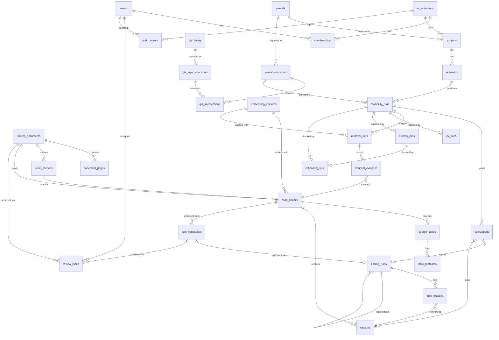

# 03 — Data Model

## 1. Purpose and conventions

This document is the single source of truth for ParcelPilot's database schema: every table, its
columns, its immutability rule, and who can see it. Every other planning document implements
against the names defined here. The two governing ideas are: evidence and decisions are never
edited, only versioned and appended to; and a tenant (an organization using ParcelPilot) can only
ever see its own project data, never another organization's.

Conventions, not repeated per table below:

- **Database:** PostgreSQL 16 with PostGIS 3.4 (geographic/geometric column types and spatial
  queries) and pgvector 0.7 (a vector column type and nearest-neighbor search, used for semantic
  retrieval).
- **Primary keys:** `uuid`, via `gen_random_uuid()` (`pgcrypto`).
- **Timestamps:** every table has `created_at timestamptz not null default now()`. Genuinely
  mutable tables also have `updated_at timestamptz`.
- **Tenant column:** every tenant-scoped table (§6) has `org_id uuid` referencing `organizations`.
  Jurisdiction-shared and global tables omit it.
- **Naming:** `snake_case`, singular concept / plural table.
- **Enums:** every enum in §2 is a native Postgres `enum` type, named after the conventions doc's enum,
  snake_cased (e.g. `FinalStatus` → `final_status`).

## 2. Canonical enums

```sql
create type final_status as enum (
  'proceed_to_concept_design', 'revise_scenario', 'verify_before_committing', 'insufficient_evidence'
);
create type finding_status as enum ('pass', 'fail', 'unknown', 'verify', 'insufficient_evidence');
create type criticality as enum ('critical', 'high', 'medium', 'low');
-- v1 ships use, height, all three setbacks, plus exactly one of density/parking/lot_coverage,
-- picked by the reviewer during M2. See §7.
create type rule_category as enum (
  'use', 'height', 'setback_front', 'setback_side', 'setback_rear',
  'density', 'parking', 'lot_coverage'
);
create type coverage_bucket as enum ('checked', 'manual_review', 'unknown');
create type jev_route as enum (
  'proceed_to_concept_design', 'revise_scenario', 'contact_city',
  'engage_zoning_professional', 'collect_missing_information', 'insufficient_evidence'
);
create type jev_risk as enum ('low', 'medium', 'high', 'insufficient_evidence');
create type source_status as enum ('pending_review', 'active', 'superseded', 'withdrawn');
create type review_status as enum ('unreviewed', 'in_review', 'approved', 'rejected');
create type run_status as enum ('queued', 'running', 'succeeded', 'failed', 'cancelled');
create type decision_mode as enum ('rules_only', 'structured_output_baseline', 'jev', 'shadow');
```

`coverage_bucket`, `jev_risk`, `jev_route` also appear inside `jsonb` payloads (e.g.
`jev_runs.selected_values`); the Postgres enum governs the typed column form only.

## 3. Entity relationship overview

Relationships only — not every column, and not the run/evidence tables' `jsonb` payloads. Full
columns are in §4.



## 4. Tables

The conventions doc's canonical table list has **31 tables**, not 30 — see the note at the end of this
document. Grouped below by domain for readability only; the grouping is not a schema concept.
Each entry: purpose, columns as `name type notes`, key constraints/indexes, immutability, tenant
scope.

### 4.1 Identity and tenancy

**`organizations`** — the tenant; one row per paying customer.
Columns: `id uuid PK`, `name text`, `slug text unique`, `plan text`, `created_at`, `updated_at`.
Constraints: `unique(slug)`. Tenant scope: **global**. Immutability: **mutable**.

**`users`** — a person who can log in; may belong to more than one org.
Columns: `id uuid PK`, `email text unique`, `full_name text`, `auth_provider_id text`,
`created_at`, `updated_at`, `last_login_at`.
Constraints: `unique(email)`. Tenant scope: **global**. Immutability: **mutable**.

**`memberships`** — join table granting a user access to an org, with a role.
Columns: `id uuid PK`, `org_id uuid FK→organizations`, `user_id uuid FK→users`,
`role OrgRole enum` (`owner`/`admin`/`member`/`reviewer`, per `00_conventions.md`; `reviewer` may approve rule candidates, tables, and chunks), `created_at`.
Constraints: `unique(org_id, user_id)`. Index: `(org_id)`, `(user_id)`. Tenant scope:
**tenant-scoped**. Immutability: **mutable**.

### 4.2 Projects and scenarios

**`projects`** — a development idea tied to one parcel, owned by one org; the unit a user opens
and returns to.
Columns: `id uuid PK`, `org_id uuid FK→organizations`, `parcel_id uuid FK→parcels`, `name text`,
`created_by uuid FK→users`, `created_at`, `updated_at`, `archived_at timestamptz nullable`.
Index: `(org_id)`, `(parcel_id)`. Tenant scope: **tenant-scoped**. Immutability: **mutable**.

**`scenarios`** — one proposed development concept inside a project. A user edits draft fields
freely; running feasibility copies them into a `feasibility_runs` row so the run is never affected
by a later edit.
Columns: `id uuid PK`, `org_id uuid FK→organizations`, `project_id uuid FK→projects`, `name text`,
`use text`, `units int nullable`, `height_ft numeric nullable`, `stories int nullable`,
`parking_spaces int nullable`, `ground_floor_commercial_sqft numeric nullable`,
`draft_inputs jsonb` (full input bag, superset of the typed columns), `status text` (`draft`/
`analyzed`), `created_by uuid FK→users`, `created_at`, `updated_at`.
Index: `(org_id)`, `(project_id)`. Tenant scope: **tenant-scoped**. Immutability: **mutable**
(draft fields only — a run copies inputs at run time, per the conventions doc).

### 4.3 Parcels and GIS

Parcel and GIS data describe public Milwaukee county/city records, not anything an org owns —
**jurisdiction-shared**, same as the zoning code itself (§6).

**`parcels`** — registry of known Milwaukee parcels, keyed by county tax key. One row per parcel
regardless of how many orgs have opened a project against it.
Columns: `id uuid PK`, `jurisdiction_id text` (`milwaukee-wi`), `taxkey text`, `address text`,
`latest_snapshot_id uuid FK→parcel_snapshots nullable`, `created_at`, `updated_at`.
Constraints: `unique(jurisdiction_id, taxkey)`. Tenant scope: **jurisdiction-shared**.
Immutability: **mutable** (registry; history lives in `parcel_snapshots`).

**`parcel_snapshots`** — immutable, point-in-time capture of one parcel's geometry and
attributes. A `feasibility_runs` row pins one exact snapshot id so a later county data change can
never silently alter a saved analysis.
Columns: `id uuid PK`, `parcel_id uuid FK→parcels`, `jurisdiction_id text`,
`geometry geometry(MultiPolygon,4326)`, `lot_area_sqft numeric`, `base_zoning text`,
`overlays text[]`, `special_districts text[]`, `source_layer_id uuid FK→gis_layers`,
`source_retrieved_at timestamptz`, `source_last_edit_date timestamptz`, `attributes jsonb`,
`content_hash text`, `created_at`.
Index: `(parcel_id)`, GiST on `geometry`. Tenant scope: **jurisdiction-shared**. Immutability:
**immutable**.

**`gis_layers`** — registry of GIS data sources (zoning districts, floodplain, historic
districts) — the layer definition, not its data.
Columns: `id uuid PK`, `jurisdiction_id text`, `layer_key text`, `layer_type text`
(`zoning_district`/`overlay`/`floodplain`/`historic`/`other`), `source_url text`,
`refresh_cadence text`, `active boolean`, `created_at`, `updated_at`.
Constraints: `unique(jurisdiction_id, layer_key)`. Tenant scope: **jurisdiction-shared**.
Immutability: **mutable** (registry, per the conventions doc).

**`gis_layer_snapshots`** — immutable capture of one GIS layer's full feature set at a point in
time.
Columns: `id uuid PK`, `gis_layer_id uuid FK→gis_layers`, `retrieved_at timestamptz`,
`feature_count int`, `raw_payload_ref text` (object storage path), `content_hash text`,
`created_at`.
Index: `(gis_layer_id, retrieved_at)`. Tenant scope: **jurisdiction-shared**. Immutability:
**immutable**.

**`gis_intersections`** — immutable, computed spatial join: does this parcel snapshot intersect
this GIS layer snapshot's features. How overlays and special districts get detected.
Columns: `id uuid PK`, `parcel_snapshot_id uuid FK→parcel_snapshots`,
`gis_layer_snapshot_id uuid FK→gis_layer_snapshots`, `feature_properties jsonb`,
`intersects boolean`, `overlap_pct numeric nullable`, `computed_at timestamptz`.
Index: `(parcel_snapshot_id)`, `(gis_layer_snapshot_id)`. Tenant scope: **jurisdiction-shared**.
Immutability: **immutable**.

### 4.4 Source documents and the zoning code corpus

Everything below is the municipality's official record — jurisdiction-shared, built once and
reused by every organization's analyses.

**`source_documents`** — one row per official document ingested. Satisfies Z-01: official URL,
hash, retrieval time, status, and source version are all first-class.
Columns: `id uuid PK`, `jurisdiction_id text`, `code_family text` (`zoning`), `official_url text`,
`title text`, `document_hash text`, `retrieved_at timestamptz`, `source_version text`,
`status source_status enum`, `effective_start date`, `effective_end date nullable`, `created_at`.
Tenant scope: **jurisdiction-shared**. Immutability: **immutable**.

**`document_pages`** — one row per page of a source document: extracted text plus a pointer to
the page image.
Columns: `id uuid PK`, `source_document_id uuid FK→source_documents`, `page_number int`,
`raw_text text`, `ocr_confidence numeric nullable`, `image_ref text`, `content_hash text`,
`created_at`.
Constraints: `unique(source_document_id, page_number)`. Tenant scope: **jurisdiction-shared**.
Immutability: **immutable**.

**`code_sections`** — the structural outline (chapter/subchapter/section/subsection headings)
that `code_chunks` attach to; one set per document version.
Columns: `id uuid PK`, `source_document_id uuid FK→source_documents`, `chapter text`,
`subchapter text nullable`, `section text`, `subsection text nullable`, `heading text`,
`parent_section_id uuid FK→code_sections nullable` (self-referential, builds the tree),
`sort_order int`, `created_at`.
Tenant scope: **jurisdiction-shared**. Immutability: **immutable** (tied to a document version;
a code revision produces new rows under a new `source_documents` row, never an edit here).

**`code_chunks`** — the retrievable unit of zoning text (a paragraph, table row, definition,
footnote); this is the PRD's `CodeChunk` type. `(family_id, version)` is how a chunk gets
superseded without ever being edited.
Columns: `id uuid PK`, `family_id uuid` (stable identity across versions), `version int`,
`jurisdiction text` (`milwaukee-wi`), `code_family text` (`zoning`),
`chapter/subchapter/section/subsection/heading text` (subchapter, subsection, heading nullable),
`source_type text` (`ordinance_text`/`table_row`/`footnote`/`definition`/`amendment`/
`map_legend`), `district_codes text[]`, `overlay_codes text[]`, `rule_categories rule_category[]`,
`source_document_id uuid FK→source_documents`, `official_url text`, `document_hash text`,
`effective_start date`, `effective_end date nullable`, `status source_status enum`,
`page_start int`, `page_end int nullable`, `text text`,
`table_json jsonb nullable` (present when `source_type = table_row`),
`parent_section_id uuid FK→code_sections`, `preceding_chunk_id`/`following_chunk_id uuid nullable`
(reading-order neighbors), `cross_reference_ids uuid[]`, `reviewer_status review_status enum`,
`embedding vector(1536)` (see §8 on dimension), `tsv tsvector` (generated column),
`embedding_version_id uuid FK→embedding_versions`, `supersedes_id uuid FK→code_chunks nullable`,
`created_at`.
Index: `unique(family_id, version)`, GIN on `tsv`, IVFFlat/HNSW on `embedding`, GIN on
`district_codes`/`overlay_codes`/`rule_categories`. Tenant scope: **jurisdiction-shared**.
Immutability: **immutable** (new version = new row).

**`source_tables`** — a structured table extracted from a document (e.g. a setback table), kept
both as `table_json` on the owning `code_chunks` row and here in full for footnote linkage.
Columns: `id uuid PK`, `source_document_id uuid FK→source_documents`,
`code_chunk_id uuid FK→code_chunks nullable`, `page_number int`, `table_json jsonb`,
`caption text nullable`, `created_at`.
Tenant scope: **jurisdiction-shared**. Immutability: **immutable**.

**`table_footnotes`** — footnote text attached to a `source_tables` row; zoning tables routinely
carry footnotes that change what a cell means, so these are first-class, not folded into the
table JSON.
Columns: `id uuid PK`, `source_table_id uuid FK→source_tables`, `marker text`, `text text`,
`created_at`.
Tenant scope: **jurisdiction-shared**. Immutability: **immutable**.

### 4.5 Rules and citations

**`rule_candidates`** — a machine-extracted or reviewer-drafted rule not yet approved. Per Z-05,
rows here can never drive a `pass`/`fail` finding.
Columns: `id uuid PK`, `jurisdiction_id text`, `family_id uuid` (carried into `zoning_rules` on
approval), `rule_category rule_category enum`, `district_codes text[]`, `extracted_value jsonb`,
`source_chunk_ids uuid[]`, `extraction_method text` (`llm_extraction`/`manual`),
`reviewer_status review_status enum`, `reviewer_id uuid FK→users nullable`,
`reviewer_notes text nullable`, `created_at`, `updated_at`.
Tenant scope: **jurisdiction-shared**. Immutability: **mutable** (until approved — approval
inserts a `zoning_rules` row, it doesn't edit this one).

**`zoning_rules`** — the only table a deterministic finding can cite as authority. Approved,
versioned exactly like `code_chunks`: `(family_id, version, status, effective_start,
effective_end, supersedes_id)`.
Columns: `id uuid PK`, `family_id uuid`, `version int`, `jurisdiction_id text`,
`district_code text`, `rule_category rule_category enum`, `value jsonb`
(e.g. `{"max_height_ft": 45}`), `unit text nullable`, `status source_status enum`,
`approved_by uuid FK→users`, `approved_at timestamptz`, `effective_start date`,
`effective_end date nullable`, `supersedes_id uuid FK→zoning_rules nullable`, `created_at`.
Index: `unique(family_id, version)`. Tenant scope: **jurisdiction-shared**. Immutability:
**immutable** (new version = new row).

**`citations`** — a single evidence pointer: this exact page, this exact excerpt. The shared
unit `rule_citations`, `calculations`, and validators all point at.
Columns: `id uuid PK`, `code_chunk_id uuid FK→code_chunks nullable`,
`source_document_id uuid FK→source_documents`, `page_number int`,
`anchor text nullable` (paragraph/row anchor), `excerpt text`, `created_at`.
Tenant scope: **jurisdiction-shared**. Immutability: **immutable**.

**`rule_citations`** — join table: which citations support a given approved rule.
Columns: `id uuid PK`, `zoning_rule_id uuid FK→zoning_rules`, `citation_id uuid FK→citations`,
`created_at`.
Constraints: `unique(zoning_rule_id, citation_id)`. Tenant scope: **jurisdiction-shared**.
Immutability: **immutable**.

### 4.6 Runs: feasibility, retrieval, JEV, briefing, validation

Everything below belongs to one organization's analysis of one scenario, even though the evidence
it reads is shared. Per F-05, a `feasibility_runs` row is the complete, replayable snapshot of one
analysis.

**`feasibility_runs`** — the top-level record of one "run this scenario" action. Pins the exact
ids of everything the result depends on, so a later upstream change can never alter a saved
result.
Columns: `id uuid PK`, `org_id uuid FK→organizations`, `project_id uuid FK→projects`,
`scenario_id uuid FK→scenarios`, `parcel_snapshot_id uuid FK→parcel_snapshots`,
`gis_layer_snapshot_ids uuid[]`, `input_hash text` (hash of scenario_inputs +
parcel_snapshot_id, for dedup/caching), `scenario_inputs jsonb` (copied from `scenarios` at run
time, never re-read live), `rule_version_set jsonb` (`{family_id: zoning_rules.id}` per rule
applied), `decision_mode decision_mode enum`, `status run_status enum`,
`final_status final_status enum nullable` (set only once locked), `locked_at timestamptz nullable`,
`created_by uuid FK→users`, `created_at`.
Index: `(org_id, project_id)`, `(scenario_id)`. Tenant scope: **tenant-scoped**. Immutability:
**immutable**.

**`calculations`** — one finding per rule category within a run; the rules engine's `Finding[]`
output (F-02): category, status, assumptions, proposed/allowed values, the calculation itself,
citations, confidence, review reason.
Columns: `id uuid PK`, `feasibility_run_id uuid FK→feasibility_runs`,
`rule_category rule_category enum`, `finding_status finding_status enum`,
`criticality criticality enum`, `proposed_value jsonb`, `allowed_value jsonb`,
`assumptions jsonb`, `calculation_detail jsonb` (the arithmetic/logic path, for audit and the
memo), `zoning_rule_id uuid FK→zoning_rules nullable` (null when `unknown`/
`insufficient_evidence`), `citation_ids uuid[]`, `confidence text`, `review_reason text nullable`,
`created_at`.
Index: `(feasibility_run_id)`. Tenant scope: **tenant-scoped**. Immutability: **immutable**.

**`retrieval_runs`** — one retrieval pass for one subquestion (district applicability, height,
setbacks, ...) within a feasibility run.
Columns: `id uuid PK`, `feasibility_run_id uuid FK→feasibility_runs nullable` (null for
offline/eval retrieval), `org_id uuid FK→organizations`, `subquestion text`,
`filters jsonb` (hard metadata filters applied, §10.4.D), `embedding_version_id uuid
FK→embedding_versions`, `reranker_model text`, `status run_status enum`, `started_at`,
`completed_at`, `created_at`.
Tenant scope: **tenant-scoped**. Immutability: **immutable**.

**`retrieval_evidence`** — the ranked evidence bundle a `retrieval_runs` row produced; one row
per selected `code_chunks` hit, with why it was picked.
Columns: `id uuid PK`, `retrieval_run_id uuid FK→retrieval_runs`,
`code_chunk_id uuid FK→code_chunks`, `rank int`, `relevance_score numeric`,
`selection_reason text`, `required_context_found boolean` (whether expansion to parent
heading/definitions/etc. succeeded), `created_at`.
Index: `(retrieval_run_id)`. Tenant scope: **tenant-scoped**. Immutability: **immutable**.

**`jev_runs`** — one JEV decision call. Stores the exact input state (hashed, since it's what the
model saw), the raw response, and the extracted typed values (§8.5).
Columns: `id uuid PK`, `feasibility_run_id uuid FK→feasibility_runs`,
`org_id uuid FK→organizations`, `decision_mode decision_mode enum`,
`input_state jsonb` (the full `PreparedDecisionState` sent to JEV), `input_state_hash text`,
`question_set_version text`, `model_version text`, `raw_response jsonb`,
`selected_values jsonb` (`{overall_risk, manual_review_required, recommended_route,
summary_safe_to_display}`), `probabilities jsonb`, `confidence numeric`, `latency_ms int`,
`status run_status enum`, `created_at`.
Index: `(feasibility_run_id)`. Tenant scope: **tenant-scoped**. Immutability: **immutable**.

**`briefing_runs`** — one call to the briefing LLM, made only after final status is locked,
against the frozen briefing contract (§8.7).
Columns: `id uuid PK`, `feasibility_run_id uuid FK→feasibility_runs`,
`org_id uuid FK→organizations`, `contract jsonb` (the frozen briefing contract sent to the
model), `contract_hash text`, `prompt_version text`, `schema_version text`,
`model_id text` (e.g. `claude-fable-5-1`), `raw_output jsonb`,
`validator_result_id uuid FK→validation_runs nullable`, `status run_status enum`,
`latency_ms int`, `created_at`.
Index: `(feasibility_run_id)`. Tenant scope: **tenant-scoped**. Immutability: **immutable**.

**`validation_runs`** — a single validator's pass over a briefing (or, for deterministic
validators, over a feasibility run directly): citation, numeric, status, action, or schema.
Columns: `id uuid PK`, `briefing_run_id uuid FK→briefing_runs nullable`,
`feasibility_run_id uuid FK→feasibility_runs nullable`, `org_id uuid FK→organizations`,
`validator_type text` (`citation`/`numeric`/`status`/`action`/`schema`), `passed boolean`,
`rejected_claims jsonb` (claims the validator refused to let through), `details jsonb`,
`created_at`.
Constraints: at least one of `briefing_run_id`/`feasibility_run_id` set. Tenant scope:
**tenant-scoped**. Immutability: **immutable**.

### 4.7 Governance

**`audit_events`** — append-only log of every state-changing action: reviewer approvals, rule
promotions, run creation, soft deletes. What makes "what changed and who did it" answerable after
the fact.
Columns: `id uuid PK`, `org_id uuid nullable` (null for actions on jurisdiction-shared data, e.g.
a rule approval), `actor_id uuid FK→users nullable`, `actor_type text` (`user`/`system`/
`worker`), `action text` (e.g. `rule.approved`, `scenario.run_started`), `entity_type text`,
`entity_id uuid`, `before_hash text nullable`, `after_hash text nullable`, `metadata jsonb`,
`created_at`.
Index: `(org_id)`, `(entity_type, entity_id)`. Tenant scope: **tenant-scoped when `org_id` is
set, otherwise global** (a shared-data action is visible to reviewers, not filtered by org).
Immutability: **immutable**.

**`review_tasks`** — the reviewer queue item: a rule candidate, a source document, or a GIS
ambiguity waiting on human sign-off.
Columns: `id uuid PK`, `jurisdiction_id text`, `task_type text` (`rule_candidate_review`/
`source_review`/`gis_ambiguity`), `entity_type text`, `entity_id uuid`,
`assigned_to uuid FK→users nullable`, `status review_status enum`,
`priority criticality enum nullable`, `created_at`, `updated_at`, `resolved_at timestamptz
nullable`.
Tenant scope: **jurisdiction-shared** (v1's review queue is entirely over shared evidence and
rules; see §8 if an org-scoped review task type turns out to be needed). Immutability:
**mutable**.

**`gold_cases`** — a labeled evaluation case: a parcel + scenario with an expert-reviewed
expected outcome, used to score JEV and the rules engine against ground truth (§9).
Columns: `id uuid PK`, `family_id uuid` (stable identity across revisions of the same case),
`version int`, `parcel_taxkey text`, `scenario_inputs jsonb`, `expected_findings jsonb`,
`expected_jev_output jsonb`, `expected_final_status final_status enum`,
`frozen_at timestamptz nullable` (set once locked for use in a benchmark run),
`created_by uuid FK→users`, `created_at`.
Tenant scope: **jurisdiction-shared** (an evaluation asset over the shared Milwaukee corpus, not
tenant data). Immutability: **mutable until `frozen_at` is set, then immutable**, enforced the
same way as other immutable tables (§5) — a trigger rejects `UPDATE`/`DELETE` once `frozen_at is
not null`.

**`embedding_versions`** — registry of which embedding model/dimension produced a given
`code_chunks.embedding`. Insert-only: never update a row another table already references, per
the conventions doc's "never mix versions in one index" rule.
Columns: `id uuid PK`, `provider text` (`openai`/`voyage`), `model_name text` (e.g.
`text-embedding-3-large`), `dimension int`, `truncated_from int nullable` (e.g. `3072`
truncated to `1536`), `is_active boolean`, `created_at`.
Tenant scope: **jurisdiction-shared**. Immutability: **immutable** (insert-only — a row is
never edited once any `code_chunks`/`retrieval_runs` row references it; a model change adds a
new row and flips `is_active`, it doesn't touch the old one).

### 4.x `table_fragments` (added 2026-09-21 after review)

**Purpose.** One row per physical piece of a table on one page. A logical table that spans pages (e.g. `Table 295-505-2` in `data/zoning-code-pdfs/CH295-sub5.pdf`, pages 783–784) is one `source_tables` row (the *table family*) made of several `table_fragments`. Row-level provenance points at fragments, so every normalized cell can be opened on its exact page.

| Column | Type | Notes |
|---|---|---|
| `id` | uuid pk | |
| `source_table_id` | uuid fk → `source_tables` | the family |
| `document_id` | uuid fk → `source_documents` | |
| `page_no` | int | |
| `fragment_index` | int | order within the family |
| `bbox` | jsonb `[x0,y0,x1,y1]` | PDF points |
| `detected_headers` | jsonb | header cells as extracted on this page |
| `rows` | jsonb | raw extracted rows for this page, in source order |
| `continuation_signals` | jsonb | which of the continuation-detector signals fired (see `04` §3.6) |
| `extractor` | text | `camelot_lattice` / `camelot_stream` / `docling` / `pdfplumber` / `manual` |
| `extraction_metrics` | jsonb | e.g. Camelot accuracy/whitespace |
| `page_image_key` | text | object-storage key of the rendered page |
| `review_status` | `ReviewStatus` | |
| `created_at` | timestamptz | |

Immutability: **immutable** (a re-extraction creates new fragments and a new `source_tables` version). Tenant scope: jurisdiction-shared.

`source_tables` gains: `family_key` (e.g. `tbl_295_505_2`), `page_start`, `page_end`, `canonical_columns` jsonb (normalized column schema incl. district codes), `canonical_rows` jsonb (every row with `source_fragment_id`, `row_index_on_page`, `applicable_footnote_ids[]`), `merge_review_status` (`ReviewStatus`; a multi-fragment family must be reviewer-approved before any row can seed a `rule_candidates` row).

### 4.y `decision_policy_versions` (added after review)

**Purpose.** Versioned, reviewable configuration for the final status policy: JEV thresholds, criticality defaults, the `allowed_next_actions` table by status/trigger. Referenced by `feasibility_runs.decision_policy_version_id`.

| Column | Type | Notes |
|---|---|---|
| `id` | text pk | e.g. `policy.v1` |
| `config` | jsonb | thresholds, action table |
| `config_hash` | text | |
| `approved_by` | uuid fk → `users` | |
| `effective_start` / `effective_end` | timestamptz | |
| `created_at` | timestamptz | |

Immutable; global (not tenant-scoped). Also committed to the repo as JSON; the DB row records which version each run used.

### 4.z `decision_comparisons` (view, not a table)

A SQL view joining `feasibility_runs`, `jev_runs` (by `provider`), and `gold_cases` to expose, per run: rules-only route, JEV route, baseline route, expert label, policy-used flag. Feeds the M6 dashboard. No storage of its own.

## 5. Immutability and versioning

**Immutable tables** (append-only, no `UPDATE`/`DELETE` except the retention policy below):
`parcel_snapshots`, `gis_layer_snapshots`, `gis_intersections`, `source_documents`,
`document_pages`, `code_sections`, `code_chunks`, `source_tables`, `table_footnotes`,
`zoning_rules`, `citations`, `rule_citations`, `feasibility_runs`, `calculations`,
`retrieval_runs`, `retrieval_evidence`, `jev_runs`, `briefing_runs`, `validation_runs`,
`audit_events`, `embedding_versions`.

**Mutable tables:** `organizations`, `users`, `memberships`, `projects`, `scenarios` (draft
fields only), `parcels` (registry), `rule_candidates` (until approved), `review_tasks`,
`gis_layers` (registry), `gold_cases` (mutable until `frozen_at` is set, then immutable).

**"New version = new row"** governs `zoning_rules` and `code_chunks` specifically, via the same
four-part pattern: `family_id` (the concept's stable identity across time), `version`
(incrementing integer), `status` (a `source_status` value — `active` is the one live row per
family), and `effective_start`/`effective_end`. Amending a rule or a chunk never edits the
existing row — it inserts a new row with the same `family_id`, `version + 1`,
`supersedes_id` pointing at the row it replaces, and flips the old row's `status` to `superseded`
with an `effective_end` date. Anything that already cited the old row (a `calculations` row, a
`rule_citations` row) keeps pointing at that exact `id` forever, so a historical result never
silently changes meaning.

**Pinning:** a `feasibility_runs` row must never drift. It stores the exact
`parcel_snapshot_id`, the exact `gis_layer_snapshot_ids`, the exact `rule_version_set` (a
`family_id → zoning_rules.id` map, not district codes), the exact `code_chunks`/`citations` ids
referenced by its `calculations`, and the exact `embedding_version_id` used by any retrieval it
triggered. Replaying a run later — for audit, a support request, a regression test — reads only
rows those ids point to, never "whatever's current."

**Deletion:** no immutable-list table is ever hard-deleted, including on an account-deletion
request. The pattern is soft delete plus a retention policy: a `deleted_at` column (added only
where needed, on mutable tables like `projects`) hides a row from the app, and a scheduled job
permanently removes rows past the org's retention window from storage and backups. Run-history
tables (`feasibility_runs` and everything downstream — `calculations`, `retrieval_runs`,
`retrieval_evidence`, `jev_runs`, `briefing_runs`, `validation_runs`) are **never** deleted
per-row even under retention — the whole chain for an org is removed together, driven by
`feasibility_runs.org_id`, only when that org's account actually closes and its retention window
lapses.

**Database-level enforcement**, not just app discipline — every immutable table gets
`REVOKE UPDATE, DELETE ON <table> FROM app_role;` plus a trigger that raises on any attempt:

```sql
create or replace function reject_mutation() returns trigger as $$
begin
  raise exception '% is immutable; insert a new row instead', tg_table_name;
end;
$$ language plpgsql;

create trigger no_update_code_chunks
  before update or delete on code_chunks
  for each row execute function reject_mutation();
-- repeated for every table in the immutable list above
```

The retention job runs as `service_role` (§6), which is granted `DELETE` directly and bypasses
the trigger via `session_replication_role = replica` for that one transaction — the only path
that can remove an immutable row, and it's logged to `audit_events` before it runs.

## 6. Tenant isolation policy

Organizations own `projects`, `scenarios`, `feasibility_runs` and everything downstream of it,
plus any project documents an org uploads (object storage, not a table — see below). Municipal
official sources — `source_documents`, `document_pages`, `code_sections`, `code_chunks`,
`source_tables`, `table_footnotes`, `rule_candidates`, `zoning_rules`, `citations`,
`rule_citations`, every `gis_*` table, `parcels`, `parcel_snapshots`, `review_tasks`,
`gold_cases`, and `embedding_versions` — are **jurisdiction-shared**: `org_id` is absent, and a
`jurisdiction_id` column scopes them instead. Every organization reads the same Milwaukee zoning
corpus; no organization writes to it directly.

**Enforcement is Row Level Security (RLS), a Postgres feature that adds an invisible `WHERE`
clause to every query against a table, based on a value the app sets for the current database
session:**

```sql
alter table projects enable row level security;

create policy tenant_isolation on projects
  using (org_id = current_setting('app.org_id')::uuid);
```

`current_setting('app.org_id')` reads a per-connection setting the app sets at the start of each
request's transaction (`select set_config('app.org_id', $1, true);` — `true` scopes it to that
transaction), using the authenticated user's active org (`memberships.org_id`). If it's never
set, RLS has nothing to match against and the policy returns zero rows — the safe failure mode is
"you see nothing," not "you see everything."

**Service role:** background workers that maintain jurisdiction-shared data (GIS refresh,
ingestion, rule approval) run as a separate Postgres role, `service_role`, granted `BYPASSRLS`.
This bypass is scoped by convention to the jurisdiction-shared tables — application code never
touches a tenant-scoped table without also setting `app.org_id` (a code-review checklist item,
since Postgres `BYPASSRLS` is all-or-nothing per role, not table-scoped). Anything the service
role writes to a tenant-scoped table (rare — mainly system `audit_events`) sets `org_id` itself
rather than relying on RLS.

**Required test:** CI connects as `app_role` (RLS-bound, not `service_role`), enumerates every
table with an `org_id` column via `information_schema`, and asserts `pg_policies` has at least
one policy for each — the trip-wire against a future migration that adds a tenant-scoped table
and forgets the policy:

```sql
select t.table_name
from information_schema.columns c
join information_schema.tables t on t.table_name = c.table_name
where c.column_name = 'org_id' and t.table_schema = 'public'
  and t.table_name not in (select tablename from pg_policies);
-- must return zero rows
```

**Project document uploads:** files are stored under `org/{org_id}/projects/{project_id}/...` in
the R2 bucket, so a prefix scan can never cross an org boundary even under an application bug,
and the app hands the browser a short-lived **signed URL** (a temporary, cryptographically
authorized download link) rather than a public path.

## 7. Migrations

**Tool: Drizzle ORM migrations** — schema is defined in TypeScript, Drizzle generates plain SQL
migration files, and those `.sql` files are committed and reviewed like any other code change,
not auto-applied from the TypeScript on deploy.

Migration groups, in dependency order:

1. **Extensions** — `pgcrypto`, `postgis`, `vector`.
2. **Orgs and users** — `organizations`, `users`, `memberships`.
3. **Jurisdiction and sources** — `source_documents`, `document_pages`, `code_sections`,
   `code_chunks`, `source_tables`, `table_footnotes`, `embedding_versions`.
4. **GIS** — `parcels`, `parcel_snapshots`, `gis_layers`, `gis_layer_snapshots`,
   `gis_intersections`.
5. **Rules** — `rule_candidates`, `zoning_rules`, `citations`, `rule_citations`.
6. **Projects and runs** — `projects`, `scenarios`, `feasibility_runs`, `calculations`,
   `retrieval_runs`, `retrieval_evidence`, `jev_runs`, `briefing_runs`, `validation_runs`.
7. **Eval and governance** — `gold_cases`, `review_tasks`, `audit_events`.
8. **RLS policies** — enable RLS and add the tenant-isolation policy on every tenant-scoped table
   from groups 2 and 6, plus the immutability triggers (§5) on every table in the immutable list.

**Rule: immutable tables get additive-only migrations.** Once a table is on the immutable list,
later migrations may add a nullable column or a new index, but may never rename or drop a
column, reinterpret a column's type, or add a `NOT NULL` constraint without a default — any of
those would rewrite history the table promises to keep exact. A schema change that needs to
reinterpret an immutable table's meaning ships as a new table (a new `family_id` namespace, or a
new table entirely), not an `ALTER`.

## 8. Open decisions for 08

- **Vector dimension:** this doc specifies `vector(1536)` (OpenAI `text-embedding-3-large`
  truncated from 3072, per the conventions doc's default) — confirm before M4, since changing it later
  means re-embedding all of `code_chunks` and bumping `embedding_versions`.
- **Partitioning:** whether `feasibility_runs` and its children should be partitioned by
  `org_id` or by month once run volume grows. Not needed at pilot scale; worth deciding before
  it becomes a migration under load.
- **`memberships.role` enum:** `owner`/`admin`/`member` above is not in the conventions doc's canonical
  enum list — confirm the exact role set and whether it needs a conventions doc entry.
- **Tenant scope for `review_tasks` and `gold_cases`:** treated as jurisdiction-shared here
  because v1's reviewer queue and gold set are entirely about the shared Milwaukee corpus. If an
  org-specific review need appears later, confirm whether that's a new table or a nullable
  `org_id` added to `review_tasks`.
- **Immutability/tenant-scope calls not explicit in the conventions doc:** the conventions doc's immutable/mutable
  originally didn't name `parcels`, `code_sections`, `citations`, `rule_citations`, or
  `embedding_versions` (now added to `00_conventions.md`; `review_tasks` and `gold_cases` were already listed as mutable). This doc assigns each a scope by analogy
  to its closest sibling table (documented per table in §4) — worth a quick conventions doc-owner confirm
  rather than treating these as settled.
- **`audit_events` retention:** no retention window is specified yet for the audit log itself,
  which by nature could outlive the org data it describes. Needs a policy before launch.

---

*Note on table count: the conventions doc's canonical table list (line 27 of `00_conventions.md`)
enumerates 31 distinct table names, not 30 — every one is covered in §4 above. Flagging this
rather than silently dropping one to hit "30," since the conventions doc is the source of truth for names
and this doc mirrors it exactly, count included.*
