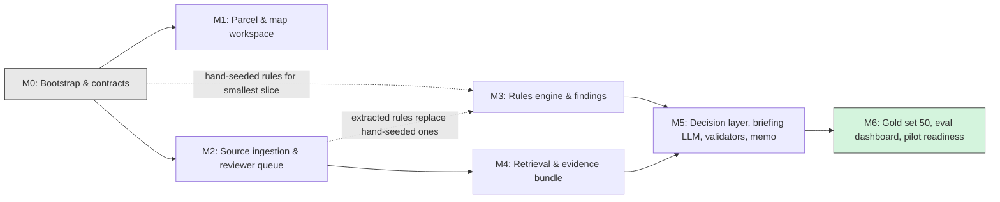

# 06 — Delivery Plan

## 1. Purpose

This document turns the PRD's phase narrative (Section 11) into milestones an engineering team can plan, staff, and exit-check against. It uses the milestone names, enums, and table names fixed in the project's conventions doc — every later planning doc must use these same names.

The PRD describes delivery as six phases (0 through 5). This plan restructures that work into seven milestones, M0 through M6, chosen so that independent pieces of work (the parcel/map UI, and document ingestion) can run in parallel instead of waiting on each other in a straight line. The table below maps PRD phases to milestones.

| PRD phase | Milestone(s) | Why the mapping isn't 1:1 |
|---|---|---|
| Phase 0 — Product contract and JEV harness foundation | M0 — Bootstrap & contracts | Direct match. |
| Phase 1 — Full parcel-to-scenario experience | M1 — Parcel & map workspace (unscored scenarios) | Direct match. |
| Phase 2 — Evidence and reviewed-rule vertical slice | M2 — Source ingestion & reviewer queue, M3 — Rules engine & findings, M4 — Retrieval & evidence bundle | The PRD bundles ingestion, reviewed rules, deterministic checks, and hybrid retrieval into one phase. This plan splits them into three milestones so ingestion (M2) and the numeric rules engine (M3) can be staffed and tested independently, and so retrieval (M4) — which needs a populated corpus from M2 — can proceed in parallel with M3 rather than blocking it. |
| Phase 3 — JEV decisioning, reasoning brief, and report experience | M5 — Decision layer (rules_only + shadow JEV) & briefing LLM & validators & memo | Direct match. |
| Phase 4 — Evaluation and limited pilot | M6 — Gold set 50 + evaluation dashboard + pilot readiness | Direct match. |
| Phase 5 — Expansion only after evidence | Out of scope until after M6 (Section 5) | Explicitly deferred; not a milestone in this plan. |

## 2. Smallest demoable vertical slice

**Definition:** M0 + M1 + M3, using hand-entered, reviewer-approved rules for **one** district, producing a templated memo for **one** real Milwaukee parcel — built and demoed before any retrieval (RAG, retrieval-augmented generation — using a search step to find supporting text before answering) exists.

### Why this comes before retrieval

The product's core safety claim is a chain: a sourced fact leads to a deterministic finding, which leads to a conservative status, which leads to a cited memo. Every one of those four links can be proven on real data with the fewest possible moving parts by skipping automated retrieval entirely for the first demo. Instead of building a full ingestion-and-reranking pipeline before anyone can see whether the chain holds together, the reviewer hand-types a small number of dimensional rules for one district directly into `zoning_rules`, each one already carrying a real citation into the code. That lets the team prove the rules engine, the status policy, and the memo renderer end to end on one real parcel — the riskiest and most valuable parts of the product — weeks before the ingestion pipeline (M2) or retrieval (M4) would otherwise be ready. If the chain doesn't hold at this scale, it won't hold at scale with retrieval added either, so this is the cheapest place to find that out.

### Demo script

1. The domain reviewer hand-enters a small set of `zoning_rules` rows for one selected district (use, height, and at least the front setback), each row linked to a `rule_citations` record that points at a real page in the Milwaukee zoning code.
2. The user opens the web app and searches a real Milwaukee address or TAXKEY.
3. The app resolves the parcel through `parcels` / `parcel_snapshots` and shows parcel geometry and the base district on the map (M1's unscored-scenario workspace — no scored scenario yet).
4. The user creates a scenario: unit count, stories, height, parking spaces, ground-floor use, saved to `scenarios`.
5. The rules engine (`packages/rules-engine`, pure TypeScript, no network or database calls of its own) runs `ScenarioInputs` + `ParcelFacts` + the hand-entered `ApprovedRule[]` and produces a `Finding[]`, one per `RuleCategory`, each with a calculation record in `calculations`.
6. A deterministic policy function turns the `Finding[]` into a single `FinalStatus`, applying hard overrides — never landing on a more permissive status than the strictest individual finding.
7. A templated (non-LLM) memo renders the findings, the `FinalStatus`, and the citations, carrying the fixed label "Preliminary zoning screen — not an official zoning determination."
8. The reviewer compares the rendered memo against a `gold_cases` row they authored for that same parcel ahead of time.

### How it's tested

The reviewer authors a `gold_cases` row for the demo parcel with the expected `Finding[]` per category, the expected `FinalStatus`, the expected manual-review triggers, and the required citations. An automated test loads that case, runs it through the rules engine and the status policy function, and asserts an exact match on every field — not a fuzzy or approximate comparison. Separately, the reviewer reads the rendered memo's actual language (not just the underlying data) and signs off that it correctly describes the finding, uses none of the banned terms, and cites the right source pages. Both checks have to pass before the slice counts as demoable.

## 3. Milestones

### M0 — Bootstrap & contracts

**Goal:** Stand up the repo, CI, local environment, and shared contracts so every later milestone builds on the same scaffolding. Get the district and reviewer decisions made early, since they gate real work in M2 and M3.

**Depends on:** Nothing — this is the starting point.

**Work items:**
- Bootstrap a pnpm monorepo with `apps/web`, `packages/zoning-core`, `packages/rules-engine`, `services/worker-py`, and `apps/worker`.
- Wire GitHub Actions CI on day one: typecheck, unit tests, build on every push and pull request. Prove it works by deliberately breaking a test, watching the check go red, then reverting the break.
- Stand up `docker compose` for the local environment: PostgreSQL 16 with PostGIS 3.4 and pgvector 0.7, MinIO (local S3-compatible storage), and `worker-py`.
- Build feature-flag scaffolding for `DecisionMode`, defaulting to `rules_only`.
- Commit the canonical enums as shared types: `FinalStatus`, `FindingStatus`, `Criticality`, `RuleCategory`, `CoverageBucket`, `JevRoute`, `JevRisk`, `SourceStatus`, `ReviewStatus`, `RunStatus`, `DecisionMode`.
- Seed the `source_documents` table with the verified official Milwaukee zoning-code URLs (rows marked as pending review; full detail to be filled in from the ingestion work in M2 and the retrieval work in M4).
- Recruit at least one domain reviewer (a planner, architect, or zoning attorney) and hold the district-selection meeting to pick the 2–4 v1 districts from the RM-family (residential multifamily) and NS/LB-family (neighborhood commercial) candidates.
- Author and get reviewer sign-off on the first 15 `gold_cases` rows.
- Wire `audit_events` as the append-only log that every later milestone writes decisions and status changes into.

**Expected artifacts:** repo skeleton with the four packages/apps above; a passing-then-proven-failing-then-passing-again CI workflow file; `docker-compose.yml`; `DecisionMode` flag wired into config; seeded (pending) `source_documents` rows; a written district-selection decision; 15 reviewer-signed `gold_cases` rows.

**Test strategy:** the CI pipeline is itself the primary test surface at this stage — typecheck, unit test run, and build on every change. The team proves the gate actually catches problems by breaking one test on purpose and confirming the check goes red before reverting. No product logic exists yet, so there is no integration, e2e, or eval testing in this milestone beyond smoke-testing that the docker compose environment starts cleanly from a fresh clone.

**Exit criteria:**
- CI runs on every push/PR and has been demonstrated to fail on a broken test, not just pass on a working one.
- `docker compose up` brings up a working local environment from a fresh clone with no manual steps.
- `DecisionMode` flag exists in code and defaults to `rules_only`.
- Domain reviewer is under agreement; district selection is documented and signed off.
- 15 `gold_cases` rows are committed with reviewer sign-off.
- `source_documents` contains real (even if unreviewed) rows for the target chapters — not placeholder text.

**Estimated effort:** 2 engineer-weeks (assumes 1–2 engineers).

---

### M1 — Parcel & map workspace (unscored scenarios)

**Goal:** Let a user find a real Milwaukee parcel and save a scenario against it, with no scoring yet. This validates the core navigation and data-entry UX before any rule logic depends on it.

**Depends on:** M0 (repo, database, CI, tenancy tables).

**Work items:**
- Address / TAXKEY / map-click parcel search against `parcels` and `parcel_snapshots`.
- Stacked or ambiguous parcel resolution flow, for addresses that map to more than one TAXKEY.
- MPROP (Milwaukee's property/assessment data source) profile display, base zoning district, and selected GIS overlays via `gis_layers`, `gis_layer_snapshots`, and `gis_intersections`.
- Source freshness indicator, reading effective/version dates off `source_documents`.
- Scenario creation form: unit count, stories, height, parking spaces, ground-floor use, saved to `scenarios`.
- Projects and scenario history: list, reopen, and compare past scenarios, scoped by `projects`.
- Save-as-draft path: an unscored scenario writes only draft fields on `scenarios`, with no `feasibility_runs` row yet.
- Tenancy: `organizations`, `users`, and `memberships` enforce that projects and scenarios are scoped to the owning organization.

**Expected artifacts:** parcel search page, map view, scenario creation form, and project/scenario history list in `apps/web`; a parcel ingestion job (in `worker-ts` or `worker-py`) populating `parcels`/`parcel_snapshots`; at least the base zoning layer populated in `gis_layers`.

**Test strategy:** unit tests on parcel resolution logic (address parsing, TAXKEY disambiguation); integration tests against real Milwaukee parcel/GIS data (or recorded fixtures of it) for address and TAXKEY search; one end-to-end test that searches a real address, resolves the parcel, creates a scenario, and confirms it appears in project history; a manual reviewer check comparing MPROP fields and base district shown in the app against county records for 3–5 real parcels.

**Exit criteria:**
- A real Milwaukee address resolves to the correct parcel geometry and base zoning district.
- A known stacked/ambiguous address resolves through the UI without the app crashing or silently picking the wrong parcel.
- A scenario can be created, saved as a draft, and retrieved from project history.
- One organization cannot see another organization's projects or scenarios (tested, not just assumed).

**Estimated effort:** 3 engineer-weeks (assumes 1–2 engineers).

---

### M2 — Source ingestion & reviewer queue

**Goal:** Get the real Milwaukee zoning-code documents into a versioned pipeline, and build the reviewer queue that turns raw parsed text into reviewer-approved rules.

**Depends on:** M0 (seeded source registry). Can run in parallel with M1 — neither depends on the other.

**Work items:**
- Populate `source_documents` with the real chapters covering the M0-selected districts, each with a `SourceStatus` lifecycle (`pending_review` → `active`, with `superseded`/`withdrawn` for later versions).
- Build the parsing pipeline in `worker-py` (pdfplumber for text and coordinates per decision 003, Docling evaluated as structure parser, OCRmyPDF for scanned pages, Camelot for tables, table-family reconstruction per `04` §3.6) producing `document_pages`, `code_sections`, `code_chunks`, `source_tables`, and `table_footnotes`.
- Build a page-level source viewer in the reviewer UI (`review-ui`, role-gated inside `apps/web`).
- Build the chunk/table review queue backed by `review_tasks`, moving items through `ReviewStatus`: `unreviewed` → `in_review` → `approved`/`rejected`.
- Extract `rule_candidates` for the use, height, and setback categories in the selected district(s), manually or with lightweight tooling assistance.
- Link every `rule_candidate` — and later every `zoning_rules` row — to a `citations` record pointing at a specific `document_pages` entry.
- Build the approval flow that promotes an approved `rule_candidate` into a new, versioned, immutable `zoning_rules` row.

**Expected artifacts:** a fully ingested chapter (or chapters) with page-level chunks in `document_pages`/`code_chunks`; a working reviewer queue UI; the first batch of reviewer-approved `zoning_rules` rows for the M0-selected district, each with at least one `rule_citations` entry.

**Test strategy:** unit tests on the parsing/chunking logic, specifically table-to-footnote association, since that's the most failure-prone part of PDF parsing; an integration test that ingests a known fixture PDF and asserts the expected count and shape of `code_chunks`/`source_tables`/`table_footnotes`; a manual reviewer check where the reviewer approves and rejects a sample batch through the real UI and confirms the page anchors shown match the source PDF; every approval writes an `audit_events` row, checked in the integration test.

**Exit criteria:**
- At least one full, real Milwaukee zoning chapter is ingested with page-level chunks, not just a sample.
- A reviewer can approve or reject a `rule_candidate` through the UI and see it become (or fail to become) an active `zoning_rules` row.
- Every `zoning_rules` row has at least one `rule_citations` entry pointing at a `document_pages` record.
- No chunk from a `withdrawn` or `superseded` source is ever served to a reviewer as current.

**Estimated effort:** 3 engineer-weeks (assumes 1–2 engineers; can run in parallel with M1's 3 weeks rather than adding to the timeline).

---

### M3 — Rules engine & findings

**Goal:** Run the deterministic numeric checks against reviewer-approved rules and produce citable findings. This is the milestone that makes the safety chain (sourced fact → finding → status → memo) real.

**Depends on:** M0 (contracts). Needs at least a hand-seeded or reviewer-approved `zoning_rules` set for one district — for the smallest demoable slice (Section 2), this can be hand-entered directly, without waiting on the full M2 reviewer-queue workflow; for the milestone to be considered fully done, it should run against real M2 output.

**Work items:**
- Build `packages/rules-engine` as a pure TypeScript package with zero I/O: input is `ScenarioInputs` + `ParcelFacts` + `ApprovedRule[]`, output is `Finding[]` plus a calculation record.
- Cover the v1 `RuleCategory` set: `use`, `height`, `setback_front`, `setback_side`, `setback_rear`, plus the reviewer's chosen sixth category (`density`, `parking`, or `lot_coverage`).
- Classify each category into a `CoverageBucket` (`checked`, `manual_review`, or `unknown`).
- Persist calculation output to `calculations`, and orchestrate runs through `feasibility_runs`, which copies scenario inputs at run time (immutable, so a later scenario edit never silently changes a past run's inputs).
- Build the deterministic policy function: `Finding[]` → a single `FinalStatus`, enforcing that the result is never more permissive than the strictest individual finding or an active policy flag.
- Add hard-override handling for overlay/special-district detection: these route to `verify_before_committing` by default unless reviewed.
- Surface manual-review triggers and unsupported categories in the UI.

**Expected artifacts:** `packages/rules-engine` with its own unit test suite; `feasibility_runs` and `calculations` rows generated from real scenarios; a `FinalStatus` visible in the web app for a scored scenario.

**Test strategy:** unit tests are the primary gate here — because the engine is a pure function with no I/O, it can be tested exhaustively, covering `pass`/`fail`/`unknown`/`verify`/`insufficient_evidence` for each category. Gold-case tests load every `gold_cases` row, run it through the engine, and assert an exact match on `Finding[]` and `FinalStatus` — not an approximate one. The domain reviewer signs off on the calculation logic itself for the selected district's dimensional standards, separate from the automated tests.

**Exit criteria:**
- `packages/rules-engine` has no runtime dependency on the database, network, or filesystem — checked by the import graph, not just by convention.
- All 15 M0 gold cases pass exact-match assertions against the engine's output.
- An explicit unit test proves `FinalStatus` is never more permissive than the worst individual `Finding` or an active policy flag.
- A parcel intersecting an overlay or special district routes to `verify_before_committing` by default.

**Estimated effort:** 3 engineer-weeks (assumes 1–2 engineers).

---

### M4 — Retrieval & evidence bundle

**Goal:** Replace the hand-entered-rule shortcut used for the demo slice with real hybrid retrieval, so evidence can be pulled from the full ingested corpus rather than one pilot chapter.

**Depends on:** M2 (an ingested corpus to search over). Can run in parallel with M3 once M2 has produced chunks — M4 and M3 both consume M2's output but don't depend on each other.

**Work items:**
- Build the embedding pipeline: an `embedding_versions` row per model choice (default OpenAI `text-embedding-3-large`, truncated 3072→1536, or Voyage `voyage-3` as the alternative), embedding every `code_chunks` row.
- Build the hybrid index: PostgreSQL `tsvector` (keyword) combined with pgvector (semantic similarity search), plus a reranker step (default Cohere `rerank-v3.5` via API, with a local `bge-reranker-v2-m3` fallback for offline use).
- Build the `retrieval` package: metadata-filtered hybrid search producing `retrieval_runs` and `retrieval_evidence` rows.
- Assemble evidence bundles that feed both the M2 reviewer queue and, later, the M5 briefing contract.
- Build the retrieval evaluation harness: Recall@k (the fraction of relevant passages found in the top k results) and table/footnote recall against a labeled set of source passages.
- Build the re-embedding workflow for when `embedding_versions` changes, and make sure two embedding versions are never mixed in the same index.

**Expected artifacts:** a populated pgvector index over the M2 corpus; `retrieval_runs`/`retrieval_evidence` rows; a retrieval evaluation report with a baseline Recall@k and table/footnote recall score.

**Test strategy:** integration tests against a labeled passage set, checking whether the retriever surfaces the correct chunk for a known query; an evaluation script scoring Recall@k and table/footnote recall against the PRD's retrieval targets. No end-to-end user-facing test is required in this milestone, since retrieval isn't wired into the live scenario flow until M5.

**Exit criteria:**
- Recall@k and table/footnote recall are measured and documented against a labeled passage set.
- Retrieval never returns evidence from a `source_documents` row that isn't `active` (no `pending_review`, `superseded`, or `withdrawn` sources reachable).
- A test proves that changing `embedding_versions` doesn't silently mix vector spaces from two different models in one index.
- Evidence bundles assemble cleanly from `retrieval_evidence` for at least the M2-ingested chapter, in the shape M5's briefing contract expects.

**Estimated effort:** 3 engineer-weeks (assumes 1–2 engineers; runs in parallel with M3, so it doesn't add to the elapsed critical-path time as long as M2 finishes early enough to feed both).

---

### M5 — Decision layer (rules_only + shadow JEV) & briefing LLM & validators & memo

**Goal:** Wire the full decision chain end to end — prepared state, JEV (the judgment/evaluation component that proposes a route) running in shadow only, a locked `FinalStatus`, and a validated, cited memo. JEV enters here, but strictly as an observer: nothing it outputs reaches the user yet.

**Depends on:** M3 (findings and `FinalStatus` logic) and M4 (the evidence bundle needed for the briefing contract).

**Work items:**
- Build `PreparedDecisionState` construction from `Finding[]` plus the evidence bundle, with the state's hash logged for reproducibility.
- Integrate `jev-client` with `DecisionMode=shadow`: every call is logged to `jev_runs`, and the resulting `JevDecision` is compared against the `rules_only` decision table, but never affects the `FinalStatus` shown to the user while in shadow mode.
- Extend the deterministic policy function to apply hard overrides after the shadow comparison; `FinalStatus` continues to be driven entirely by the `rules_only` route while `DecisionMode=shadow`.
- Define the frozen briefing contract (the fixed input shape the briefing LLM is allowed to see) and call the briefing LLM (`claude-fable-5-1` as the recommended default model) only after `FinalStatus` is locked.
- Build the output validators — five families (citation, numeric, status, action, schema) implemented as the eleven checks in `05` §7 — logging every check to `validation_runs`; any validator failure falls back to the templated (non-LLM) brief instead of showing unvalidated output.
- Render the memo/report from `briefing_runs`: validated JSON in, rendered memo out, always carrying the "Preliminary zoning screen — not an official zoning determination" label.
- Build a comparison dashboard showing JEV's shadow-mode decisions next to the `rules_only` baseline, per gold case.

**Expected artifacts:** populated `jev_runs`, `briefing_runs`, and `validation_runs` tables for real scenarios; a rendered memo in the web app; a shadow-mode comparison dashboard.

**Test strategy:** unit tests per validator (citation, numeric, status, action, schema), each tested independently against deliberately malformed inputs; an integration test running the full path from `PreparedDecisionState` through the JEV shadow call, the locked `FinalStatus`, the briefing call, and a validated memo; a gold-case evaluation comparing JEV's shadow route against both `rules_only` and the expert label, confirming JEV output never reaches `FinalStatus`; a manual reviewer check reading a sample of rendered memos for banned language and citation accuracy.

**Exit criteria:**
- `DecisionMode=rules_only` and `DecisionMode=shadow` can run side by side in the same environment, and a test proves `FinalStatus` is unaffected by JEV output while in shadow mode.
- Every rendered memo either passes every validator in `05` §7 or falls back to the templated brief — no unvalidated LLM output is ever shown to a user.
- `jev_runs` contains a logged shadow-mode comparison for every case in the gold set.
- A scan of rendered memo output across the gold set finds none of the banned terms ("approved," "by right," "fully compliant," "permitted," "compliant") used to describe a zoning outcome.

**Estimated effort:** 4 engineer-weeks (assumes 1–2 engineers).

---

### M6 — Gold set 50 + evaluation dashboard + pilot readiness

**Goal:** Expand the gold set, run the full JEV evaluation against the PRD's launch gates, and make the go/no-go call on whether JEV ships live or the product launches on `rules_only` alone.

**Depends on:** M5 (shadow-mode JEV data, validators, and memo rendering).

**Work items:**
- Expand `gold_cases` to at least 50 reviewer-labeled cases, spanning the PRD's required case types: straightforward covered cases, height and setback failures, mixed-use classification questions, incomplete parking facts, floodplain or overlay triggers, special-district cases, stacked condominium ambiguity, amended or superseded code, missing source data, and conflicting evidence.
- Run the three-way comparator evaluation — `rules_only` baseline, a conventional structured-output baseline, and JEV — against the same frozen gold set.
- Build the evaluation dashboard (Grafana or Metabase over Postgres) scoring the PRD Section 9.4 metrics.
- Measure decision-layer latency (p95) and cost per completed screen.
- Measure calibration empirically: confidence bands must be validated against real outcomes, not assumed.
- Get reviewer sign-off on the core test scenarios and all user-facing limitation language.
- Document the go/no-go decision on enabling `DecisionMode=jev` for the pilot.

**Expected artifacts:** 50+ `gold_cases` rows, versioned and frozen; the evaluation dashboard; a written report scoring every PRD 9.4 metric; a documented go/no-go decision; a pilot-ready build.

**Test strategy:** the evaluation suite runs against the full 50-case gold set and scores every PRD 9.4 metric; a regression test confirms the `rules_only` path still works standalone with `DecisionMode=jev` disabled; reviewer sign-off is tracked as a named exit criterion, not folded into automated testing.

**Exit criteria** — the PRD Section 9.4 launch gates, stated verbatim:
- **Safety (high-risk/manual-review recall):** JEV must not be lower than the rules-only baseline; target at least 95% on expert-labeled high-risk cases.
- **Routing quality (exact or safe-equivalent route agreement):** target at least 85% agreement with expert-reviewed routing labels.
- **Evidence safety (unsafe permissive route rate):** 0% where deterministic gates or labels require manual review or insufficient evidence.
- **Added value (manual-review precision or analyst-time reduction):** improve precision by at least 10 percentage points over rules-only, or reduce analyst routing time by at least 25%, without safety degradation.
- **Calibration (reliability of confidence against correctness):** confidence bands must be empirically measured; no unvalidated confidence threshold may be used in production.
- **Stability (repeat-route consistency on identical state):** 100% identical typed result for an identical frozen input, subject to provider determinism guarantees; otherwise measure and document variance.
- **Performance (decision-layer latency):** p95 at or below one second for a standard prepared state.
- **Cost (cost per completed screen):** recorded and compared to the structured-output baseline; commercial pricing set only after pilot-volume measurement.

**Fallback:** if JEV fails to clear the incremental-value gate, or any launch gate above, ship with `DecisionMode=rules_only` and remove JEV from the critical path. That still leaves a viable zoning-diligence product.

**Estimated effort:** 3 engineer-weeks (assumes 1–2 engineers), though the gold-set expansion is bottlenecked on reviewer availability, not engineering time — plan the reviewer's calendar accordingly.

## 4. Sequencing and parallelism

- **M0 is a hard prerequisite for everything.** No other milestone can start meaningfully before it, because it's where the repo, CI, contracts, and reviewer relationship all come from.
- **M1 (parcel/map UI) and M2 (source ingestion) can run in parallel** once M0 is done. Neither one depends on the other's output.
- **M3 (rules engine) depends on M0**, and needs at least a hand-seeded district's worth of `zoning_rules` to be meaningfully testable. For the smallest demoable slice (Section 2), that seed can bypass the full M2 reviewer workflow. For M3 to be considered fully complete against real conditions, it should be exercised against M2's actual reviewer-approved output.
- **M4 (retrieval) depends on M2's ingested corpus** and can run in parallel with M3 — both consume M2's output but don't depend on each other.
- **M5 is the convergence point:** it depends on both M3 (findings) and M4 (the evidence bundle for the briefing contract), so it can't start until both are done.
- **M6 depends on M5.**

**Critical path:** M0 → M2 → M3 → M5 → M6. M1 runs alongside without extending this path, since nothing downstream depends on it. M4 also runs alongside M3 (both start once M2 delivers a corpus) and should finish no later than M3 if staffed comparably, so it doesn't extend the path either — but if M4 is delayed, it delays M5.

**The one hard gate:** no `DecisionMode=jev` in production without the gold set at 50 or more cases and every PRD Section 9.4 gate metric cleared, as documented in M6's exit criteria. Nothing short-circuits this gate — a partial pass on the metrics means the fallback (`DecisionMode=rules_only`) ships instead.

## 5. Out of scope until after M6

Deferred to PRD Phase 5, and only taken up once the selected-district workflow and the JEV hypothesis have cleared their gates:

- Additional zoning districts beyond the 2–4 selected in M0.
- Overlay and special-district *interpretation* (M0–M6 only detect and route these to `verify_before_committing`; interpreting them is out of scope).
- Massing analysis.
- Financial integrations.
- Title review.
- Environmental review.
- Permit submission.
- Multi-city support (the product remains `milwaukee-wi` only through M6).
- Project-document ingestion (tenant-scoped client documents, as opposed to the shared municipal official documents ingested in M2).

## 6. Milestone dependency diagram

